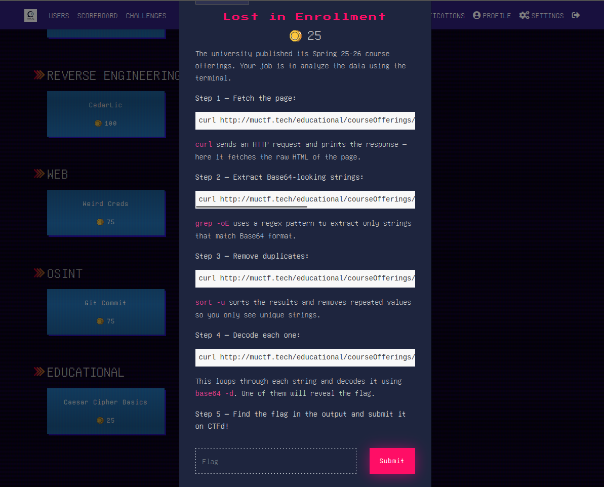
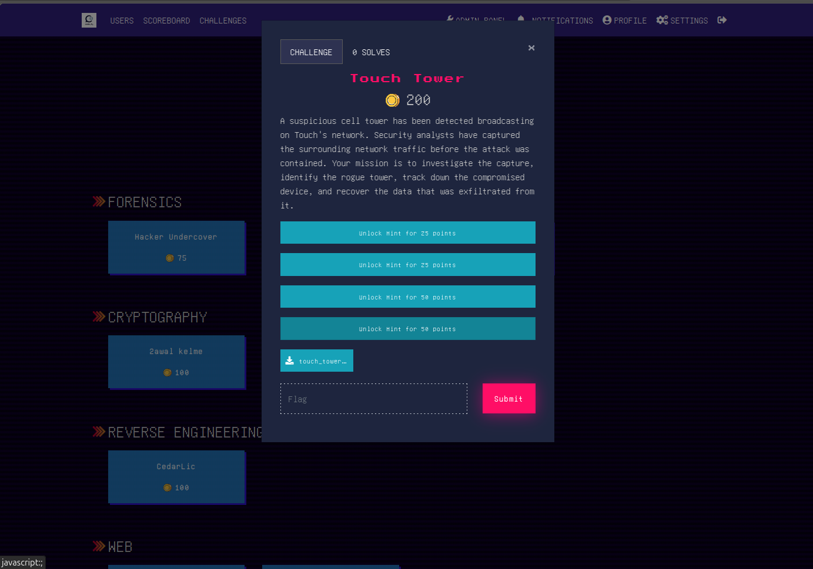
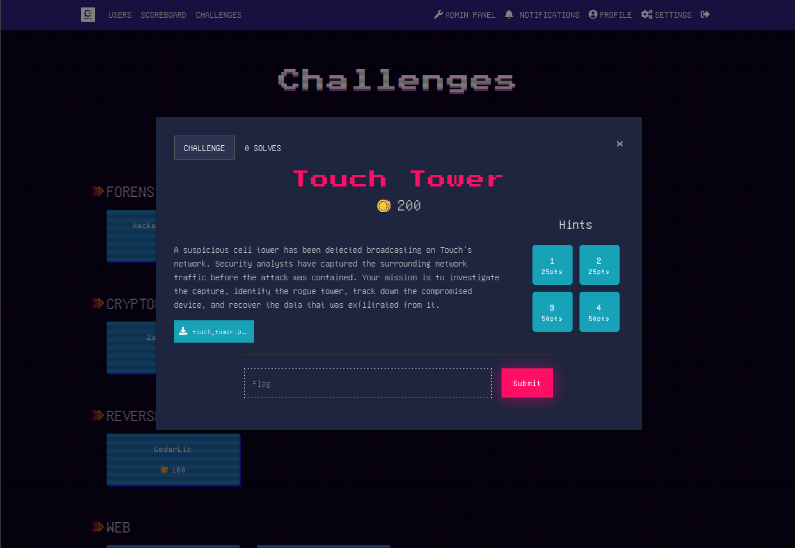

# CTFd Challenge Modal UI Tweaks

A custom Theme Header snippet (CSS + JS) for CTFd using the **Pixo theme**.
Improves the challenge modal layout to be cleaner, more functional, and closer to picoCTF's style.

---

## Before vs After

### Without Hints
| Before | After |
|--------|-------|
|  |  |

### With Hints
| Before | After |
|--------|-------|
|  |  |

## Features

- Wider modal (1000px)
- Two-column layout: description on the left, hints on the right
- Hints displayed as a numbered grid with cost labels (e.g. `25pts`, `free`)
- "Hints" title hidden automatically if no hints exist
- Description expands to full width when no hints are present
- Click-to-copy button on all code blocks
- Hint confirmation modal styled with border and reduced width
- Flag input and submit button separated by a clean divider line

## How to Use

1. Go to your CTFd **Admin Panel**
2. Navigate to **Config → Appearance → Theme → Theme Header**
3. Paste the contents of [`theme-header.html`](theme-header.html) into the field
4. Click **Save**

## Notes

- Tested on **CTFd v3.8.1** with the **Pixo theme**
- Copy button works on **HTTPS only** — enable SSL via Cloudflare (Flexible mode) for full browser support
- May need minor adjustments for other CTFd themes

## License

free to use and modify :}
